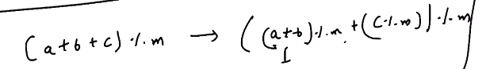

# 2. Modulo properties
Created Tuesday 30 June 2020

**Proof**: Visualize a = k*n + r

**Addition/Subtraction/Multiplication** - all have equivalent laws

* (a ◦ b) mod(n)= (a mod(n) ◦ b mod(n)) mod(n) - Basic
* If a ≡ b mod(n), then a◦k ≡ (b◦k) mod(n) - for any int k
* If a ≡ b mod(n) and

 c ≡ d mod(n), then
 a◦c ≡ b◦d mod(n)

*****

**Exponentiation**(with 3rd number)

* If a ≡ b mod(n) → a^k^ ≡ b^k^ mod(n)
* In many exams, last k digits are asked, it is just N mod(10^k^)

Note: Binomial theorem is also required here for proof

*****

**Division**

* *This is tricky - consider *4 ≡ 8 mod(4), dividing would yield 1 ≡ 2 mod(4) or 2 ≡ 4 mod(3) both are wrong. So division is not **well defined.**
* 

* Use modulo at each **intermediate stage**, so that no range overflow can occur, if there's a chance.
* Modulo is O(1), so no problem with complexity. **Note: This is not accurate**
* 2^64^ is the range.

 

