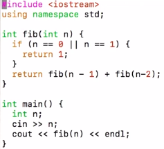

# 1. DP Basics - Fibonacci Number
Created Tuesday 30 June 2020

* Forget about DP let's talk about fibonacci numbers.
* 0, 1, 1, 2, 3, 5, 8 ...

* This solution is very bad - O(2^n^)
* We can store our work to reduce the time complexity.
* Memoization - Top down. Intialized to zero - O(n)

* Bottom up approach: We start with the base cases and an array which stores the answers. Note that an array is not necessary in recursion, because dependencies are just the previous two values. But in many problems they are very important.

*****

Our main problem is divided into subproblems, for which some of their work is common, i.e they are dependent on some 3rd level subproblem(s). These type of problems are called dynamic programming problem.

