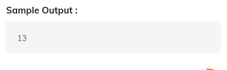

# 4. Knapsnack - Problem
Created Sunday 19 July 2020

	// main code
	#include<iostream>
	using namespace std;
	#include "Solution.h"
	
	int main(){
	
	  int n; 
	  cin >> n;
	  int* weights = new int[n];
	  int* values = new int[n];
	
	  for(int i = 0; i < n; i++){
	    cin >> weights[i];
	  }
	
	  for(int i = 0; i < n; i++){
	    cin >> values[i];
	  }
	
	  int maxWeight;
	  cin >> maxWeight;
	
	  cout << knapsack(weights, values, n, maxWeight);
	
	}
	
	
	
	
	//your code
	
	int knapsack(int* weights, int* values, int n, int maxWeight){
	
	  /* Don't write main().
	   *  Don't read input, it is passed as function argument.
	   *  Return output and don't print it.
	   *  Taking input and printing output is handled automatically.
	  */
	
	
	}

