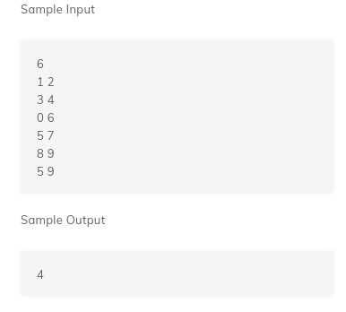

# 3. Activity Selection
Created Sunday 19 July 2020

* WA

Sort the activities w.r.t ending time.
Pick the activities which end early. This creates an optimal substructure.
Greedy works because we allow for other activities to take place, most activities are available in our approach.

