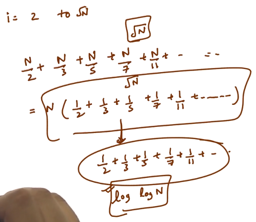

# 3. Complexity of Sieve of Eratosthenes
Created Tuesday 28 July 2020

The answer for the above series is log(logn) for n primes. **Merten's Theorem**.
So the time complexity is nloglog(√n) = O(n*log(log(n))) **Accepted.**

