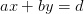

# 1. Sachin and Varun
Created Wednesday 29 July 2020

We need number of pairs.

Two for loops, O(d^2^/a.b) ~ 10^18^ **not accepted**

*****

Only one loop, check divisibility, One y for one x.
O(d/b) ~ 10^9^ **not accepted**

*****

ax+by=d ⇒

