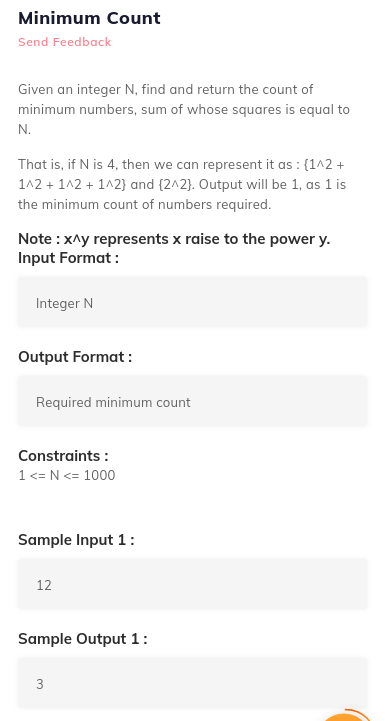
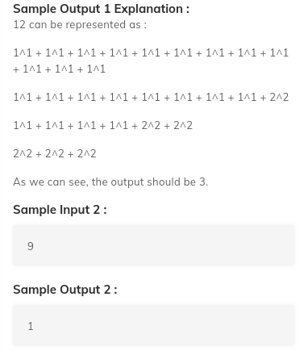

# 6. Minimum Count
Created Saturday 18 July 2020



```c++
//main
#include <bits/stdc++.h>
using namespace std;
#include "solution.h"

int main()
{
	int n;
	cin >> n;
	cout << minCount(n);
}

//your
int minCount(int n)
{
	//Write your code here
}
```
