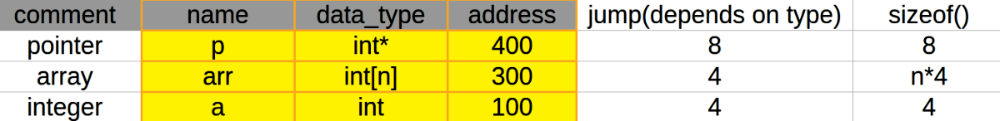

# 3. Arrays and Pointers
Created Sunday 22 December 2019

Arrays same as pointer?

#### Short answer
An array uses a pointer to save the address of the first element.
The notation [] is just syntactic sugar.

#### Long answer

* Array variable is functionally a pointer to the the first element's address.

What are the differences:

1. ``sizeof()`` gives the size of the array, in the local scope. This happens because the type is set as int[] and not int*. But + works on the int* part, hence arithmetic operation is the same as a pointer. i.e no new variable of 8 bytes is stored for an array. 

* **Important: **Symbol table is able to differentiate between a pointer and an array. 

2. ``&`` operator is the same for both 'arr' and '&arr'. Value of 'a' is just the address of a. It does not need to go to the RAM for reading(no traversal required).

* While &p and p is different if p is a pointer, the first is the address of the pointer variable and the second is the address of the variable that p points to, respectively.
* An observation: We can learn from here that **only the left part of the declaration** takes part in writing the values of the symbol table, **it is absolutely independent of the rvalue**. **This is important **because it makes C++ more intuitive and eases operator overloading and definition criteria. It is **only** in case of static arrays, that we see the sizeof() value is different as compared to the jump value.

**Q) **Can it not be that sizeof is stored differently?
**A) **No, because sizeof is the same for all. And it has to be in the table, as array names are in reality just names.

1. Pointer arithmetic is invalid for array names(yeah, exactly names), as **no changes can be made to the symbol table, we can only change the value of the memory of the variable. This means that array names cannot be reassigned ( &x is an rvalue and cannot act as an lvalue). **Hence prefix and postfix increment/decrement are also illegal.

i.e arr = p, **not allowed. arr = arr+3 wants to make a change in the address field of the symbol table which is also not allowed. arr+3 in and of itself is valid.**
but p = arr is **allowed. Also arr+i makes a jump of i*(sizeof(data_type_of_array)), i.e the ith element.**
arr[i] is the same as *(arr+i), hence i[arr] is the same = *(i+arr);
**Hence: Array names are just an entry with the address of the starting address, in the symbol table. It's not a pointer.**
**All this is the(an?) impementation of arrays in C++. This is helpful because we can use sizeof to get the size of the arrays, obviously within scope.**

Q) Why can't we get a array length outside the functions scope.
Ans: This is because in call by value, we copy only the content.
In call by address we copy only the value.
In call by reference/address we copy only the address. So we cannot copy a whole record from a symbol table.

We have gained confidence and the required understanding 
Questionnare: [Questionnaire 1, 2 and 3.](./3._Arrays_and_Pointers/questionnaire1&2&3.md)

