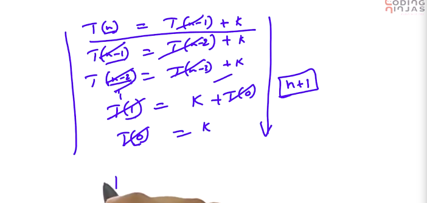

# 5. Time complexity for recursive algorithms
Created Monday 06 January 2020

* For recursive algorithms, just write down the **recurrence relation, ***with the anchor condition*.
* Make the relation as compact as possible, by combining constants(whereever possible).
* Solve this to get the time complexity. 

**Methods for solving recurrence relations.**

* Write down all (...) the recursive 'levels', solve all these equations.(By adding/subtracting/manipulating them all). i.e 
	1. *Back substitution + MI to predict the exponents*.
	2. small work + recursion work.

*****

* Recurrence Tree, we guess our solutions using this. Proved using MI.
* Master's Theorem.

**Note**: 

* ceil and floor functions can be assumed to be integers for asymptotic notation.
* Also numbers may be assumed to be exact powers of 2(this is somehwat problematic).
* We can ignore the constants with degree terms.

