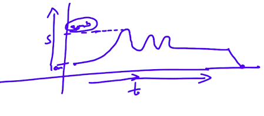
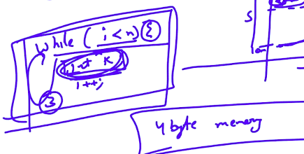

# 2. Space
Created Monday 06 January 2020

Follow these 3 rules(which we had known by ourselves)

1. Only **Auxiliary Space: **The amount of 'extra' space required as a function of input size. The size of the input does not matter, that will take space. This is not counted. **Only auxiliary space is taken into account in space complexity.**
2. **Maximum: **The space requirement is just the **maximum **amount of memory(at any point of time) that is required in the execution period   of the problem. Scope is responsible for this i.e. it deallocates the unnecessary space.

Assume that we don't use concurrent threads.
**Note**: It should be kept in mind that if we don't free space, it will have to be calculated as the sum, since the space will only be deallocated only if the program ends. **This is never the case though. At least for iterative parts.**
    

3. **Height of the tree: **In case of recursion, the memory required is the total memory of the **call stack** for all the **activation records,** when they are** the highest. ***i.e *the memory corresponding to the time when the **height of the tree is maximum**. i.e log~2~(n+1), where n =  total number of  nodes in the function tree. The memory is actually for the formal variables in each activation record. **In recursion, **we always have some memory overhead.

*3 is just an extension of rule 2.*

4. Constant space, even if the variables are being declared in a code block is not counted as an overhead, i.e RAM is assumed to be very quick. **In reality, this may affect the algorithm quality, i.e it is better to give all variables before the loop, but it is not compulsory in C++.**

