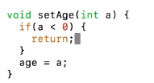
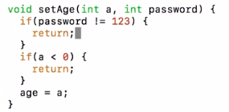

# 1. Getters and Setters
Created Wednesday 08 January 2020

#### What are setters and getters?
They are public functions created by us, which set the variables and return/print them to the outside(of the class)

#### Why use getters(accessers) and setters(mutators)?

* They are used for abstraction.
* Setters can check constraints imposed by us.

* Getters can return print data in a specified format.
* It adds a layer of authorization. We may need to provide the passwords.

*****

* When making a real world project, we **should **set important(complex, or irrelevant to the user) members as private, in order to avoid any problems. 
* The security here does not mean from outsiders. It is actually for achieving abstraction.

