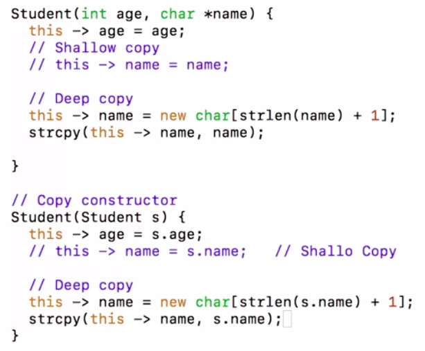
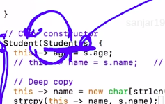

# 1. The Copy constructor
Created Friday 10 January 2020

The compiler provided copy constructor does **shallow **copying.

We have to define a copy constructor with the part which deals with the memory as per our requirement.

### Overriding the copy constructor
Note:

* Copy constructor will have params as const references, otherwise it'll be infinite loop.

 Loop.

* Copy constructors will always need another type of constructor, since their very invocation requires that an object exist. i.e the **first **object can never be created by using a copy contsructor.  

