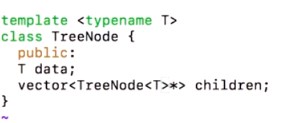

# 1. TreeNode class
Created Saturday 25 January 2020

* We'll keep the root node with us. Like we keep head for an LL.

One way to make the loop can be to keep to keep the address of of children. Options that we have:

1. Use an array to keep the addresses of the children. Updation is diffcult. Size problem.
2. Use a LL to store the addresses of the children. Acessing the children is very costly. O(n).
3. vector: We won't have to specify size at all. O(1) access. We can make a tradeoff with the resizing time. As this resizing is less sporadic. 

* **Children are stored in a vector.**
* We will call the node for a tree TreeNode, to avoid confusion with Node from a linked list.

[TreeNode.h](./1._TreeNode_class/TreeNode.h)
[treeMain.cpp](./1._TreeNode_class/treeMain.cpp)

* About templates, when we write an object inside a templated class, it is automatically assume to be of type T, unless stated otherwise.

 
First one is implicit, while the second one is explicit.
Keep it explicit where it is supposed to be.

What all is deducable? c++17 is better, it can deduce type.
TreeNode<int>* p = new TreeNode(2); will work in c++17 but not in old versions. new TreeNode<int>(2) is required. 
<https://en.cppreference.com/w/cpp/language/class_template_argument_deduction>

