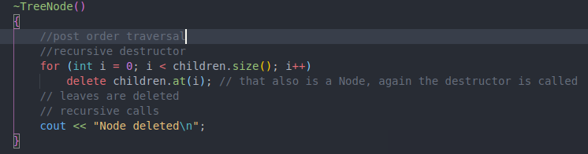
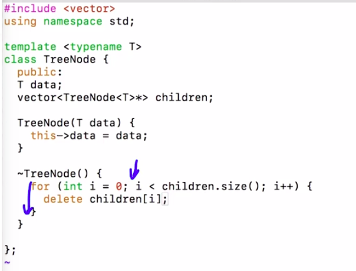

# 2. Destructor
Created Thursday 30 January 2020

How to destroy the tree?

* Process once done with deallocates memory after the program ends? The problem is memory deallocation while the program is runnning.
* When we write delete obj_name, the destructor is called first. Here memory is deallocated for the attributes. Any DS's inside need to be cleared explicitly. Taught in **OOPS 1**.
* Works like post order traversal.
* Base case does not need to be passed explicitly. When we come out of the for loop, the memory pointed by **this** is deallcoated. Hence every TreeNode is deallocated.
* Used the destructor recursively.

**MashaAllah, we had created this recursive destructor at the first time when we created the TreeNode class. Congrats on the new skill 👍️.**

Same as Ankush sir.

