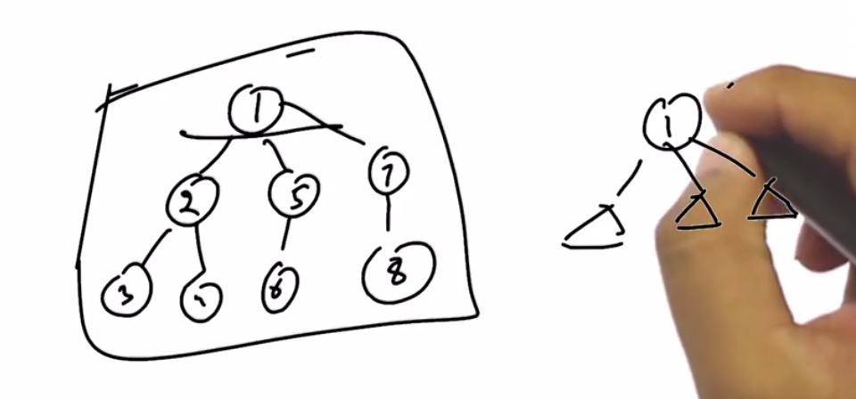

# 1. Number of nodes
Created Monday 27 January 2020

* Tree problems are very easy just **imagine **them like. 

Right side is the correct visualization. Left side is the wrong one.

Very easy, plain recursion:
template <typename T>
int countNodes(TreeNode<T> *root)
{
// prank check
if (root == NULL)
return 0;
	
// base case
if (root->children.size() == 0)
return 1; // leaf node
	
// recursion, return nodes for all children + the root
int sum = 0;
int children_num = root->children.size();
for (int i = 0; i < children_num; i++)
sum += (countNodes(root->children.at(i)));
	
return sum + 1; // 1 is for the root
}

* Recursion is a great tool, use it.

