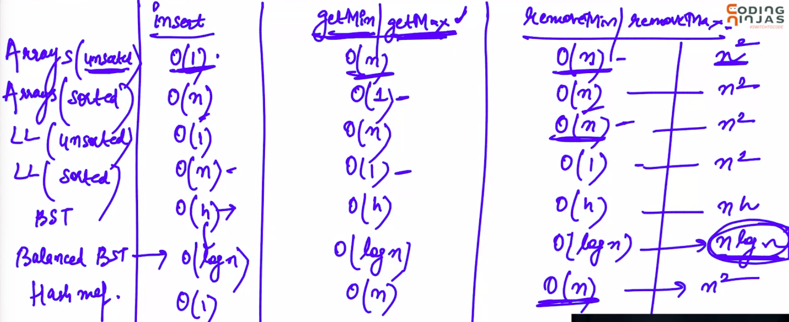

# 1. Intro to priority queue
Created Wednesday 12 February 2020

#### Selecting Items
Suppose that we have people in a queue. How to select a candidate can be decided in the following:

1. Time(known as FCFS) i.e a normal FIFO queue.
2. VIP factor - By an authority.
3. Criticality - Natural, e.g old age, medical condition.

There can be two types of queues:

1. Min -  Minimum valued exits first.
2. Max - Maxiumum valued exits first.

#### Priority queue ADT

1. push() aka insert()- insert value. It is placed w.r.t the criteria.
2. top() aka getMax()/getMin() - return the value at top, minimum(in case of min-heap) and maxiumum(in case of max-heap).
3. pop() aka removeMin()/removeMax() - Removes and returns an element.

Which data structure to use for this task:

Balanced BST is the best here.

