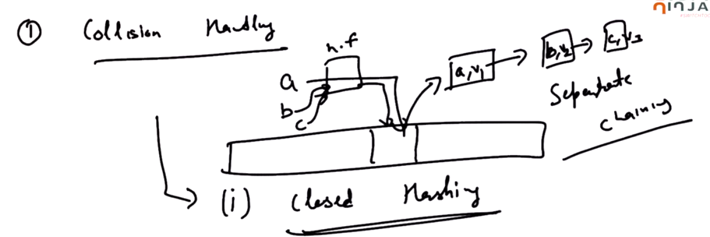

# 3. Collision Handling
Created Tuesday 18 February 2020

Problem: Two keys have the same values. How to manage it?

There are two techniques:

1. Closed Hashing(also called seperate chaining) - we will have to adjust with the same element.  Every bucket has its chain of LinkedLists.

 

2. Open addressing(aka Open chaining) - Find an alternate for the key we want to put, coz the index is already occupied. How to find an alternate place? There are many ways to do this.

Basic: h~i~(a) = hf(a) + f(i), where f(0) = 0. 
After this we will apply the compression function again if we go out of range.
Techniques just change the f(i)

1. Linear Probing: f(i) = i  	Has the problem of key localization.
2. Quadratic Probing: f(i) = i^2	^ This ensures that the keys are spread.
3. Double hashing: We will take another hash function h'(a), we do f(i) = i*h'(a)

i.e h~i~(a) = hf(a) + i*h'(a) is what we use.

*****

* Seperate chaining is more popular and easy to develop. There is no design except one hash function.

