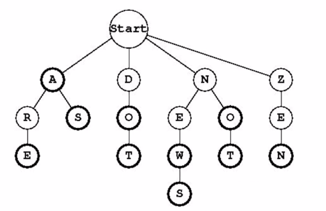
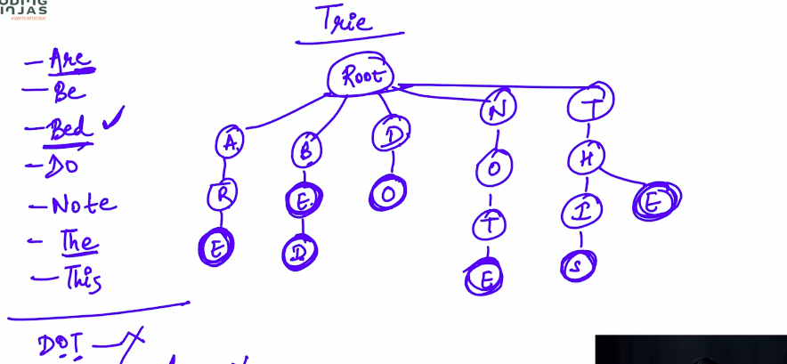

# 1. Introduction to Tries
Created Friday 06 March 2020

Prounced as tries(trys).

* Motivation: Implementation of a dictionary.

Basically for the hash function, we will take into account the length of the word length.

* Hence complexity is O(word_length) average for all ops, to be precise.
* Hence hash map is a very good thing for dictionary.
* **Tries help in search suggestions.**

But, let us study Tries data structure for now.

*****

Interface:

1. addWord()
2. Search()
3. removeWord() 

*****

* The bold letters are word terminals. i.e last letter of a word. Analogous to final states of a DFA. **This **removes the ambiguity and saves us space. For words which have same initial spelling of some length. **This can be reflected in the node structure as a boolean.**
* Important observation: Maxium children possible are 26.

*****

**Operations**:

1. Insertion: O(word_length) - for all cases. Basic traversal of 26-ary tree. Keep making nodes, make the last letter as a final-node.
2. Search: O(word_length) - for all cases. Traverse if possible, we should stop at a last-node.
3. Removal: O(word_length) - for all cases. Basic traversal of 26-ary tree. Go to the last letter, than remove, if it is a leaf. Keep removing the parents, but only if they are non-parents and they are non-final. Both these cases mean that some other word can be formed from these nodes.

e.g 

