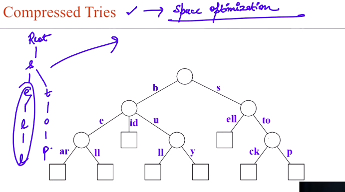
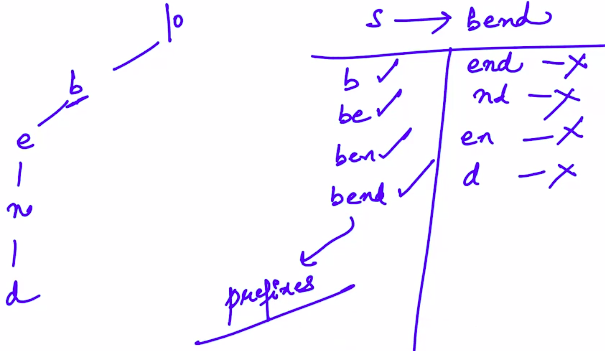
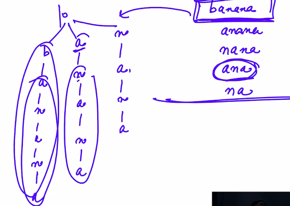

# 3. Types of Tries
Created Sunday 08 March 2020

* Why did we chose tries over hashmaps?

1. Due to less space usage. Words with some same initial length do not use space.
2. Somehwat better time complexity.
3. **Tries help with search suggestions as we type ~ O(words with same initial length). This is impossible with hashmaps - O(size of dictionary).**

*****

Types of tries:

1. Compressed tries - More space optimization. 

Here we club (consecutive strings which have only one children) together. Clubbing is **allowed **both at the ends and in-between as well.

The challenges here are:

1. During insertion we may need to break a clubbed string.
2. During deletion, we may need to break a clubbed string.

**We do this to minimize space complexity.**

* Search is the same here. 

*****

2. Suffix tries:

For pattern matching this is useful.
Differences from normal trie:

1. Words which are present but the last letter is not terminal. This can be resolved by removing the isTerminal from the trie system. No markings.
2. If some pattern is present but it cannot be reached from the root. e.g here bend is present but the usual search for 'end' returns false. i.e **suffixes** are not searchable in normal trie. **But**, this should be true in pattern matching. 

This is resolved by inserting all possible(though not redundantly) suffixes for the string in the trie. For inserting 'banana', it looks like this, note that not all suffixes were taken.

To avoid overuse of space we can do clubbing here to minimize space requirements.
**A normal trie just won't do. i.e we'd have to traverse nearly all possible paths, very slow.**

