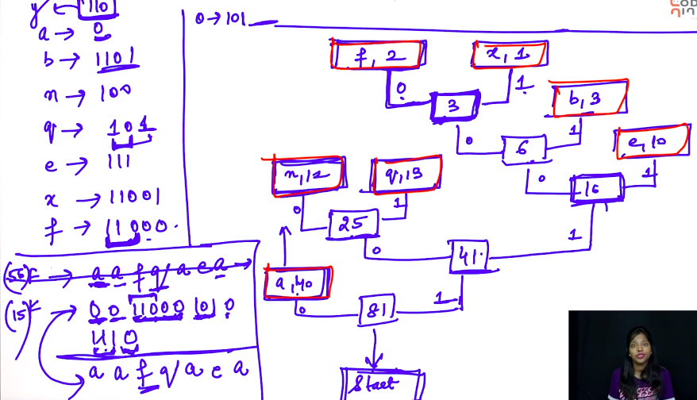

# 4. Huffman Encoding
Created Sunday 08 March 2020

This is a technique for text compression. **Remember that this compression(text) has to be lossless.**

* Huffman encoding tries to reduce the space requirement for the most ocurring characters. If some rare character(s) need to space greater than 1 bytes, it will be okay, since they are so less.
* Basically we are using different length of bits for each letter. i.e not 8 bits for each letter.
* Note that prefixes for a code cannot be the code for some other character. This happens because, in case of codes with same prefixes, when we reach a letter, the next node **is** a number, **not** a letter and vice-versa. i.e all parents are numbers(sum of frequencies of children).

Algorithm(Compression)

1. Count the frequencies and update in a 26 or 256 sized array
2. We need two minimum nodes at each iteration for forming the tree, so use a Min Priority Queue for this. Just pop 2 and push the sum. Keep doing until no letter is left.
3. Make the tree: Make a start node. 
4. Save the codes in a hashmap. key is the letter and value is teh binary code. We use this to avoid 
5. Traverse the message and generate the compressed text.

Send the decomp tree and the compressed text;

Algorithm(Decompression)

1. Make the hashmap for the tree. Keys are compressed texts values are letters.
2. Traverse the compressed text and generate the original text.

This can be done as a project in school.

