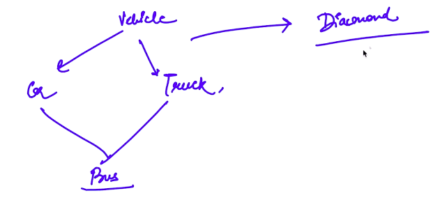

# 4. Hybrid Inheritance
Created Monday 27 April 2020

This is the 5th type of inheritance. 
Hybrid = Using more than 2 types of inheritances.

* A well known problem(called the diamond problem) arises if we use hierarchical and then multiple inheritance.
* The Bus class here gets a copy of functions in Vehicle, through Car and Track.

Order of constructors/destructors:

1. Bus calls Car 
2. Car calls Vehicle
3. Vehicle is constructed
4. Car is constructed
5. Bus calls Truck
6. Truck calls Vehicle	- **Doubt: Vehicle Already exists. Answer: Car may have called Vehicle using some params. This means that we need to call Vehicle this time too. In C++, this is hence made the default behavior.**
7. Vehicle is constructed.
8. Truck is constructed.
9. Bus is constructed.

Destructors: Reverse Order, No of constructions = No. of destructions.

*****

We can remove ambiguities using these 2 ways

1. This is solved in one way by overriding.
2. Or else we'll need an explicit call to the parent. 
3. Using the virtual keyword, this helps if we have a central abstract class.

*****

We still have a problem, D has two copies of A's functions. We don't want **clutter**.

* We need to inherit **virtually**.
* Syntax: add **virtual** modifier before the access specifier in the **inheritance list**.
* This does not copy the functions from Parent as it is, it only creates a pointer to the parent. This pointer is passsed to the derived classes, which can call the grand classes on their own. **This is allowed only in case of virtual inheritance.**

* **How does this happen**: 

1. We have a copy of a Vehicle class(not object), and one object is enough. **Direct call.**
2. We can say that D has pointer to A, which is the same through B or C. Hence only a single call is made to A.
3. Only D has an object of type A. 

* We can **prove** this by using a param constructor in both nearest parent, but giving a different value of param in the child class. The grand-class prints according to the base class. This is because the intermediate classes have not called their parent classes. It was done by the base(est) class. We can also use a static to keep count.

* **When we have extra constructors:**

1. In this case we need to call the required type of constructor in each and every base class. 

