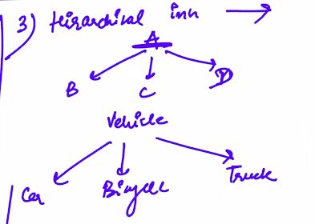

# 5. Types of Inheritance
Created Sunday 26 April 2020

1. Single Inheritance: A->B 

A single link.

2. Multilevel Inheritance: A->B->C...

Multiple levels from the same class. Like an LL. 

3. Hierarchical Inheritance: 

Multiple base classes from a single class.

4. Multiple Inheritance(inhertiting from multiple base classes) - This is of height 1.

Multiple base classes are inherited by a derived class. **Multiple Inheritance is at the core of making 'new' things from existing ones.**

* We have two types: Chain length, number of parents and number of children.

*****

1. What happens if I create a data member/member function which is present in the base class.
	1. There should be some kind of **overridding **that takes place**.**
	2. The parent parts go out of scope, unless called explicitily.(Simplest)
	3. In other words, we look in the nearest scope first. If we need the parents version, we use:

2. What happens if the derived class has two(or more) base classes which have the same data/member member function. **(Multiple inheritance) **
	1. It is ambiguous. We'll have to *specify *which function to use. Using parent : : fname() Just prepend Parent:: before the data member/member function. 
	2. If the inheritance had different modes for different parents, we **still **cannot distinguish between functions as here is no way to access public/private explicitly.

