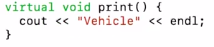

# 2. Run Time Polymorphism
Created Monday 27 April 2020

We decide the *form* at run time.

1. Using virtual functions: The functions which are present in the base class, and have been redefined in the child class. This lets the parent pointer first check if the child class has an object, i.e enable overriding. **virtual enables run-time checking.**

**Syntax**: use the keyword **virtual** before the function in the parent_class. Just like static(remember Java)

Here Vehicle is the parent class, virtual helps us **redirect** from the parent to the base.

Use cases for run-time polymorphism:

1. We have different kind of employees in our company. They have different formulae to calculate their salaries. A person calculating total salary **should not **have the burden of knowing what employee's work(given an employee pointer array). He can just invoke calSalary(). If we don't use virtual functions, we can access only the calSalary() as defined in the Employee super-class. Using virtual, the compiler will select the proper calSalary() function, this helps in writing code. Usabililty increased.

The situation:

The use-case:

