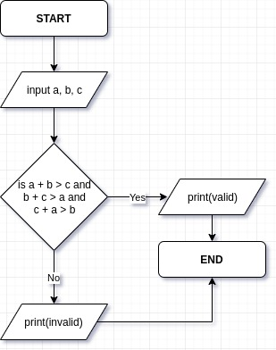
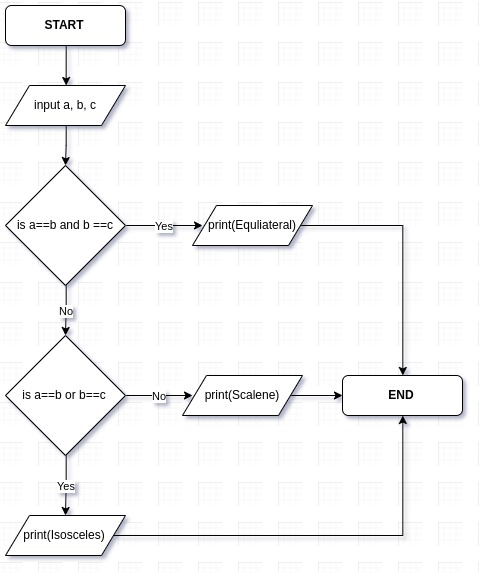
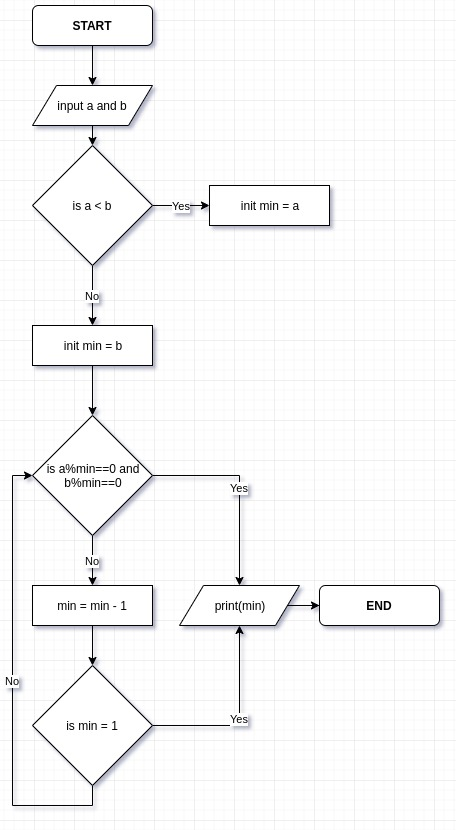
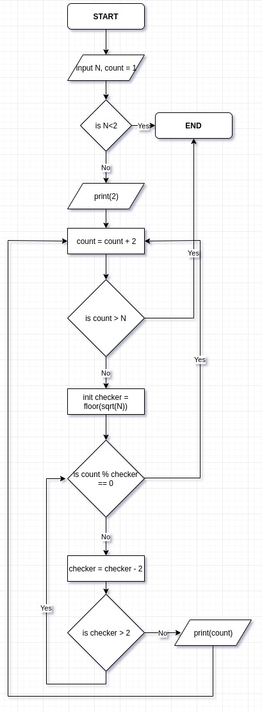
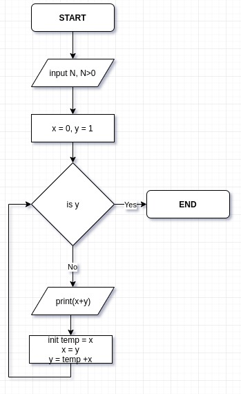
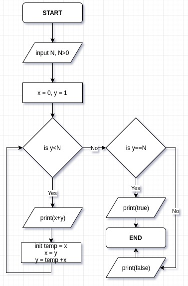

# 5. Assignments
Created Thursday 17 October 2019

Q0) Check if the given sides are of a valid triangle.
A: Input, length of the three sides a, b, c.
For every triangle, "Sum of any two sides is always greater than the 3rd side". 
We need three conditions, i.e a + b > c and b + c > a and c+a > b.

Q1) Classify triangle as Equilateral, Isosceles or Scalene.
A:
Q2) Print the sum of all even numbers from 1 to N, both inclusive.
A:
Q3) GCD of two numbers a and b.
A:
Q4) Draw a flowchart to take a number N input from from user and print all the prime numbers which lies in between 2 to N (both inclusive).
A:
[../attach_ments/print_primes.drawio](./attach_ments/print_primes.drawio)
Q5) Print all numbers between 1 and N (both inclusive) which are a part of the fibonacci series.
A: Question can be restated as printing the fibonacci numbers until we reach or exceed N.

Q6) Check if a number is a fibonacci number or not.
A: This can be restated as traversing the fibonacci numbers until the given number is reached or exceeded.
If we reach it exactly, return True. If we exceed it return false.

