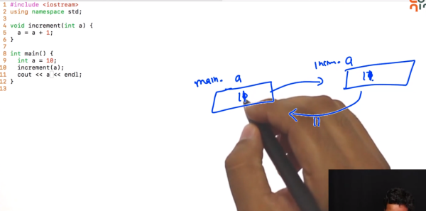

# 3. Scope of variables w.r.t functions
Created Saturday 09 November 2019

* Scopes are very important in functions, functions can access values only global variables and their local variables.
* The above is true for every variable, even in the functions.
* Variables that have the different scopes, may have the same name, but it does not mean that they are the same memory locations.
* If two variables which are both in scope at a location, then the most local one shadows the all other variable(s) with the same name, even if we have the same name deeper in the same block.

 
Here  both variables have name as 'a' but are refer to two different variables, the best way to visualize this is to rename them absoultely, i.e main.a and increment.a(in this case). 

* **Lifetime and Scope are two different concepts.**

