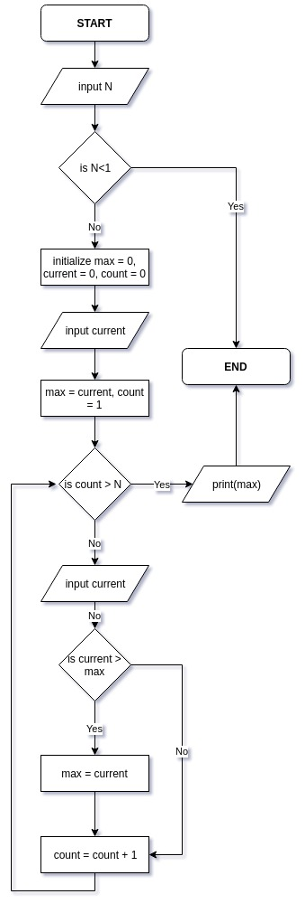
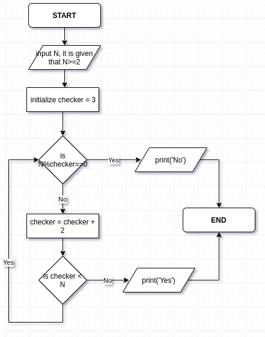

# 4. Largest of N numbers
Created Thursday 17 October 2019

Problem: finding the maximum value for a given number of integers.
A:
Q) Check if number is prime.
A: t  
To further minimize number of calculations, we check the number till sqrt(N). Because it's the largest factor N can have. 

