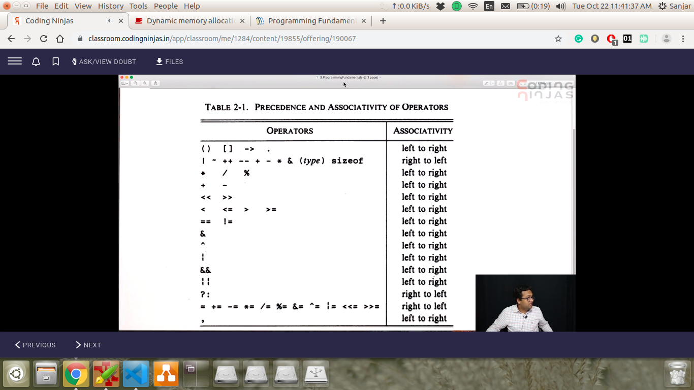

# 2. Increment Operators

Created Tuesday 22 October 2019

These are shortcuts for x = x + 1, with post and pre to make good use of them.

- pre, increases 1st and does in memory.
- post, increases after giving old value.
- <https://stackoverflow.com/questions/2989704/order-of-operations-for-pre-increment-and-post-increment-in-a-function-argument>

The statement after the two will have the same value;

- the +=, \*=, -=, [/=.](file:///Users/muhammadsanjar/Dropbox/Work_Section/career_dir/dsa_Prog/dsap_toolbox/langs/cpp_dir/codingNinjas/Intro_to_cpp/%3D.) No pre or post in this case.
- Precedence and associativity

Associativity is used only when two operators of the same operator
<https://www.geeksforgeeks.org/operator-precedence-and-associativity-in-c/>
<https://www.tutorialspoint.com/Operators-Precedence-in-Cplusplus>

Caveat: No need to remember the table, use brackets for simplicity.

- **You know it, be confident.**

