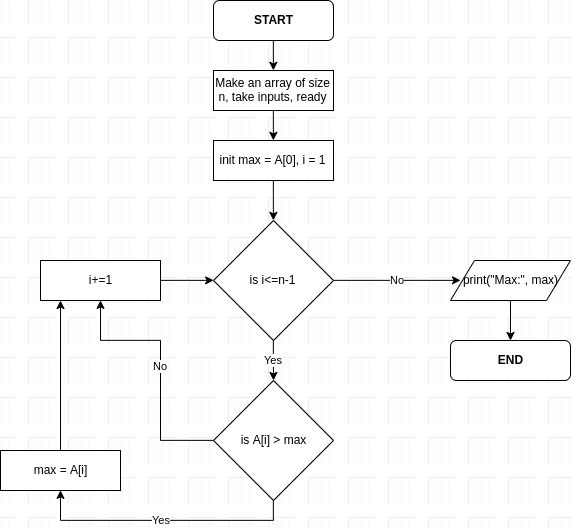

# 2. More On Arrays
Created Tuesday 12 November 2019

* We do and will only use an integer literal as the array length. So no variables allowed. Reason will be discussed later.
* Use a big number like 100, **I know this wastes space. We will deal with this in dynamic memory allocation.**

**Q**) Find the maximum integer in an integer array of size n.
**A**) Why not? If we take A[0] as optimum, two possibilities arise for the value of 'max':

1. It is the optimum. Hence, nothing will be greater or lesses than it (< or >) conditions for greatest and least respectively.[Note we don't need to update if duplicate optimums are present, no equality in comparisons].
2. It is not the optimum, here. The value will be updated to a relative optimum of the comparison, but if we hit an optimum, possibility no.2 becomes true, hence no change will occur. 
3. But what if n = 0, then, we get max as A[0] which is not even there. In such a case, i.e if we have a function called max, it has to return some integer, but it has nothing to work with. We are stuck. So for consistency, we initialize max as INT_MIN (in <climits>) or INT32_MIN(<iostream>). So it returns a hugely negative integer in the case of n=0. For The general case, this is simply case 2(or rarely case 1, i.e if all are really INT_MIN). Which eventually becomes case 2. Problem Solved. 

* INT_MIN or INT_MAX was only for a formality of consistency for the return value. It is a **convention**. **It is better to use INT_MIN or MAX for no confusion at all. **
* In the method max = A[0], we had to check if n>0 first.

*Algorithmically(Assuming n>0)*:

