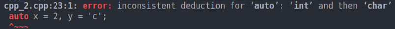

# 1. auto
Created Monday 18 May 2020


1. Letting the compiler deduce the type;
```c++
auto x = 2;
cout << x;	// works - uses predefined rules for int, in this case
```

2. Auto is homogeneous.
	1. If used in a declaration list, **will** make all the variables the same
	```c++
	auto x = 2, y = 'c'; // cannot be different
	```


2. Auto can be used for **functions too** but they shouldn't return different types of values(e.g can return an int, or a string etc), **this is the same error. **Python does it though.
```c++
auto p(int x)
{
  if(x==1)
      return 1; // returns int
  return "two";	// return string
}
```


3. auto ignores top-level **consts, **except in references. It just drops them. i.e we will need to do **const auto or auto const.**
