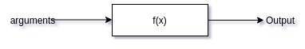

# 1. What are functions
Created Wednesday 23 October 2019
Suppose we need to calculate nCr. We can do this by making 3 for loops for n!. r! and (n-r)!
This will take 2n steps in total.  We had to do copy the code for all the three things.
This is very bad because:

* If an error happens at any part, all other parts need to be changed. 
* Code is bulky, like rambling.
* Unreadable.
* Most of the code is not reusable.

It is better that we have a funtion for doing repetitive tasks. This code can be debugged easily, looks good and is not bulky.
This solution is called a function.
 

Syntax for declaring functions in C++.
ouput_type name_of_the_function(input_type1 name1, input_type2, name2){
// code inside the function, called function definition
}

* We can pass as many parameters as we want.
* In the main function, it is **not necessary** to use a variable to store the output. If the functions returns a value, then f() will be **evaluated** as an expression.  
* the return keyword is used to end the function and return the value, or stop if the function is of type void. This is very useful in programs like prime, we can use this to our advantage.
* A function without arguments is also possible. But it will not change anything in the main function, except that it takes some time.
* If a function is given more or less* values than it is supposed to take, the programs throws and error, function not viable. *case when we have default arguments. 

