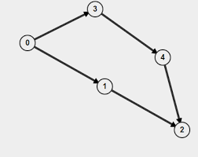

---
tags:
  - graphs
  - cycles
---
# 3. Cycle detection
Created Tue Jul 16, 2024 at 5:47 PM

## Undirected graphs - DFS
Back edges are the key to finding a cycle in an undirected graph. Cycle detection is based on watching the back edges of DFS. So the forward edge and back-edge-but-parent is benign, but back-edge-not-parent is a cycle. We are just looking for this to happen.

Note:
- If specified, would need to check for self cycles too.

## Directed graphs - DFS with extra array
Cycle detect using DFS on a undirected graph just checks if it encounters an already visited node (not a parent). But it will incorrectly detect a cycle for the below directed graph as well, at node '2'.


The realization here is that not only do we need to encounter a visited node, but it must be in the same path as the current path (i.e. same direction). In the above picture, 0 -> 3 -> 4 -> 2 is one path and 0 -> 1 -> 2 is another, so its not really a cycle. It needs to be a full circle. *i.e. We need to mark the current trail.*

Implementation wise, we can just keep an extra array called pathVisited. We will populate the visited array as usual, but for pathVisited we will mark a node as 1 when we start processing the node, and mark it as 0 when we are done processing. This means the descendants will always see their ancestors in the same path as 1, but when the subtree changes, the other subtrees pathVisited would have become 0. If we find pathVisited and visited both to be 1, that means we found a proper cycle.

Note: 
- parent check is not needed for undirected graphs, as cycle with a parent is possible (2 edges going either ways from node to parent).
- If specified, would need to check for self cycles topog.
- Cases
	1. Boolean seen. Works but slow.
		- When you encounter a node, mark it true, and when you backtrack from it, mark it false. Note that this works in both cases, if there was a cycle down the line or not.
		- What about islands? In the case above where you backtrack to report answer, and don't set the node to false. DOESNT MATTER, as you'd be returning true in the island loop too.
		- Con: will travel repeated islands for each node. Even if you set stuff to false (above) this'd still happen.
	2. Numbers. Work and are fast.
		- Use numbers (0 = unseen, 1 = seen, 2 = stable).
		- Case: one side of a tree has no cycle, and other just points to this side. Still it's not a cycle. Yes there's a common ancestor but its a directed graph so its fine. This is the case when you encounter a 2 when you begin the DFS. `return false`.
		- Case (and there is a cycle is the worst case): envelop return is fine in case of quick reporting. In this case, part of an island may have 2's and part of it may contain a cycle. But in this case, the envelop loop will report true and not continue forward. So this works.
		- Case (there is no cycle is the worst case): early check in envelop iteration start is possible. You'll have only ever have 2's. Encountering a 1 isnt possible, because if something was stuck at 1, it means it had a cycle, and we'd have returned the result, and not continued the loop.

## Code
[Problem](https://www.geeksforgeeks.org/problems/detect-cycle-in-a-directed-graph/1)

```cpp
class Solution {
public:
    bool isCycle(int node, vector<vector<int>>& adj, vector<int>& seen,
                 int label) {
        if (seen[node] == 2)
            return false; // connecting to a sibling subgraph that has no
                          // cycles, is fine. (there's a common ancestor, but
                          // they're directed, so no net cycle)

        if (seen[node] == 1) {
            return true;
        }

        seen[node] = 1; // mark current trail

        for (auto nbr : adj[node]) {
            // the parent will automatically be ignored in a directed graph
            if (isCycle(nbr, adj, seen, label))
                return true;
        }

        seen[node] =
            2; // if you reached this point, means every edge that could reach
               // here, from this side's (tree analogy) graph is checked.

        return false;
    }

    bool canFinish(int numCourses, vector<vector<int>>& prerequisites) {
        // adjacency lists are fine for DFS
        vector<vector<int>> adj(numCourses, vector<int>());
        vector<int> seen(numCourses, 0); // 0-unseen, 1-current-trail, 2 - part
                                         // of noncycle island, so fine.

        for (auto pair_ : prerequisites) {
            adj[pair_[0]].push_back(pair_[1]);
        }

        for (int i = 0; i < numCourses; i++) {
            // seen[i] = 2 means no cycle
            // seen[i] = 1 (won't ever happen), because if there was a cycle in
            // an island, we won't continue the envelope
            if (seen[i] == 0 && isCycle(i, adj, seen, i))
                return false;
        }

        return true;
    }
};
```

Minor optimization: instead of two arrays, use a single visited arrays whose values are 0 (undiscovered), 1 (node visited, not in current path) and 2 (node visited and in current path).