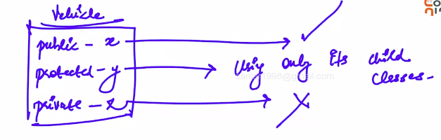
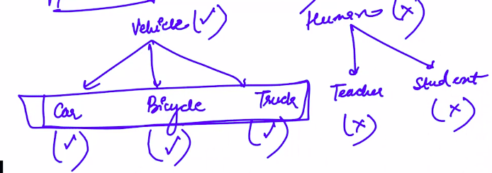

# 2. Access specifiers in inheritance

### The protected access specifier
We know public and private:
- Private: Nobody except the class can access it, not even the derived classes. 
- Public: Anybody can access these members. Including derived classes.

Protected: Only child classes can access these members. Simply said, they are like private except that they can be inherited to a derived class.

Protected example: Only vehicles and it's children can access the vehicle class's protected parts.

### Access specifier mode of inheritance
As said [[1_Inheritance_-_Concept |earlier]], *all* members(other than selected exceptions) of the parent class are available in the derived class. **But what is happens to their access specifier?**
- This is where access specifier mode needs to be specified.
- So we need to specify the access specifier of the inherited members.

This is specified in the syntax.

The access mode specifies access specifier of the inherited members.

The rule is discussed [[3_Syntax |here]].

### What happens to private members of parent class
- Private members of the parent class become inacessible (directly) in the derived class.
- Private members of the parent class are **still present and available** to use via public functions of the parent class.