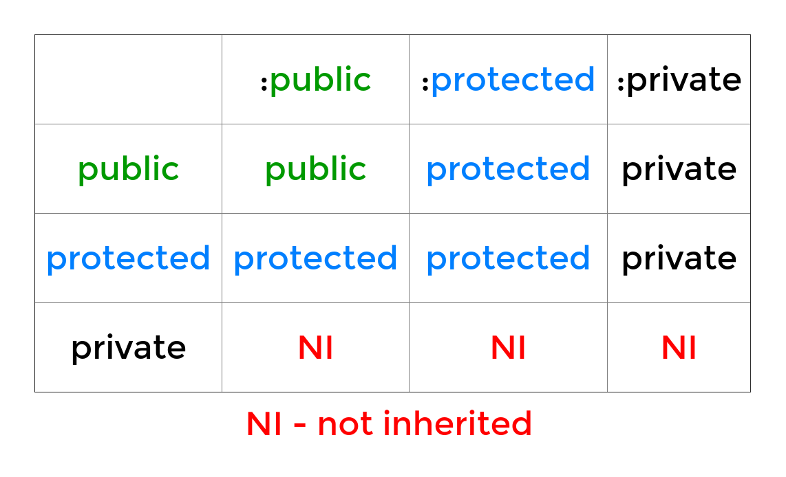

# 3. Syntax
Created Sunday 26 April 2020

### Syntax for inheritance
- Use colon (`:`), followed by access specifier and parent class name. For multiple, separate using comma. 
- In regex - `class DerivedClassName : access_spec parent1, acesss_spec parent2`. Example:
- If not specified, the default access specifier is `private`.
- Colon can be read as 'as'. Example: `public Phone, protected MusicPlayer` means inherit `Phone` as `public`, `MusicPlayer` as protected.

Example of syntax
```c++
class Camera{ /*code*/ };
class Telephone{ /*code*/ };

class Smartphone : Camera, private Telephone
{ /*code*/ };
```

* There's no limit to the number of base(aka parent classes).
* Access specifiers are used to designate access level for inherited members from parent classes.


### Rule for access specifier
* Inheritance access controls follows a simple rule - accessibility cannot be increased.



### Selective Inheritance
What if we want to inherit as ``public``, but keep some inherited members ``private``?
C++ allows selective inheritance. Just use the ``using`` keyword.
Example
```c++
#include <iostream>
using namespace std;
class A
{
	public:
    	void f(){}
    	void g();
    	void h();
};
// we want to inhertic h as public, rest as private
class B : private A
{
	public:
    	using A::f; // tagged as public
    	void f()
    	{
        	cout << "B::f called\n";
    	}
};
int main()
{
    B obj;
    obj.f(); // OK
}
```
