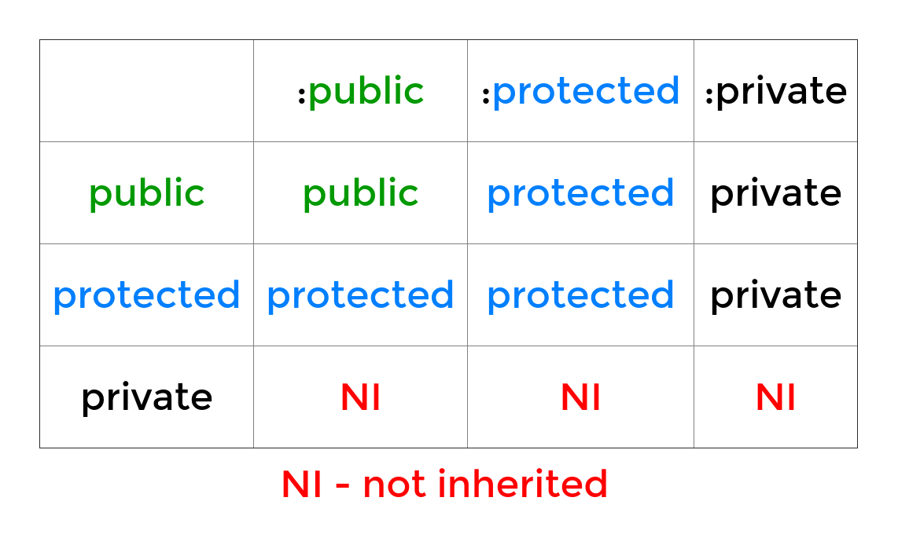

# 5.2. Types of Inheritance (level)
Created Saturday 26 February 2022

There are 3 kinds of inheritance here.
1. Public inheritance
2. Protected inheritance
3. Private inheritance

The coding effects are already seen. And are:


## 1. Public Inheritance
### Why
- This is done when we want to add something to the interface (which is public) of the superclass. 
- In other words, public inheritance specifies an ***is-a*** relation between the base and derived class objects. Example: A Ferrari is a Car. Here Car is the base class and Ferrari is publicly inherited from Car, and of course, Ferrari is a Car.
- Of course, private members of tne base class remain private and must be accessed through it's public methods in the derived class's code.

### How

### What
- It is the most widely used type of inheritance.

## 2. Protected Inheritance
This is rare, and is virtually never used.

## 3. Private Inheritance
### Why
- This is less common that public inheritance.
- This is used for pure/blunt code reuse.
- It is used when the base and derived class don't have an ***is-a*** is relation, but some/all code from the base class can be used to code the derived class.

### How
- This is the default kind of inheritance in C++, and therefore a specifier after the colon is not needed.
```c++
public Derived : Base { // no specifier means private inheritance
	...
};
```

### What
Private inheritance is not a type(***is-a***) inheritance, but a blunt implementation inheritance.