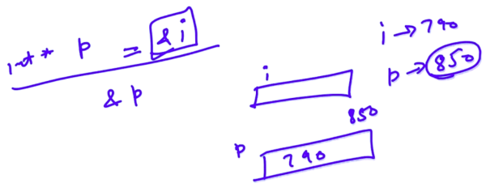
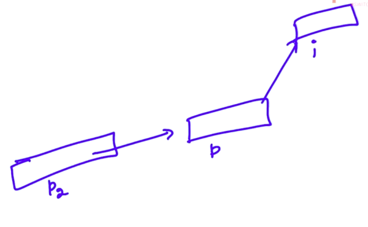

# 6. Nested pointer
Created Tuesday 24 December 2019

**Q)** Why don't we use **pointer** instead of int*, char* etc.
**Answer:** We use int* and char* etc to indicate the jump(or read span) which must be read form the address specified. Relate this to the jump field in the symbol table. 

* We do have generic pointers, but they cannot be derefenced. Have to be cast to dereference them.

Double pointer: When we do this

int i  = 10;
int* p = &i;

This takes place: 

*****

Can we use another variable to store the address of the int* p pointer. **Yes** we can.

* **That will need to be dereferenced too, hence we do **int**p1=&p; This is a pointer to pointer or "double pointer".
* Basically: data_type * variable_name; // for declarartion
* * variable_name for dereference.

**This is obvious, but worth mentioning: **
cout << *p2 << endl;
cout << p << endl;
The output is the same on both lines. We just accessed on the same *level*. 

*****

Clearing the thought smoke regarding double or n pointer chains.

* A star(*) adds a bubble with an arrow to the variable bubble.
* Derefencing refers to traversing the arrows * no. of times and reading the memory space acc to the data type.
* Don't worry of the arrayname issue here, from the symbol table, coz all addresses are held in variables. Also &x is not a valid lvalue.
* When we pass a pointer to a function, just make a variable with the address of the argument and join the arrow. We don't need to look below this level. This is **obvious coz there's no connection** of the formal parameters with the other variables of the main() function except the argument. So any links will be **made** only with the argument. **Note**: But as derefencing involves traversing of arrows, we need to be careful, as the links may be changed. This is **accessing** the data, rather than **making **the chain.
* Representation: Use a box/circle. 
	1. Value: Inside the bubble.
	2. Address of the bubble below it.
	3. Name of the bubble on the left side.
	4. Arrows from the bubble to the bubble(whose address is stored in the previous bubble - helps with dereferencing.

*****

