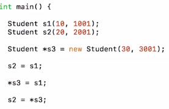

# 2. Destructor
Created Thursday 09 January 2020

**Goal of the destructor:** To deallocate memory of an object.

#### Properties of a destructor
1. Has the name same as that of the class.
2. Returns nothing.
3. Takes no arguments.

### Comparison with constructor
1. has to have `~` preceding the destructor_name(in the definition).
2. There's only one destructor per class, this follows logically from the properties.

**Note**
* If no destructor has been defined, the compiler provides one with an empty body. This provided destructor is not visible if we have defined our own destructor.
* Destructors can all other functions since the object isn’t destroyed until after the destructor executes.
* Don't call the destructor explicitly, except if the object was dynamically created. This is allowed but considered bad practice.

**When is the destructor called?**
A) There are two cases:
1. Static objects: The destructor is automatically when the function ends.
2. Dynamic objects: When we go out of scope for a dynamic object, only the pointer on the stack is freed, not the object's memory in heap. So the destructor is never called. The destructor is called only when we deallocate the memory(using *delete*).

*****
e.g

Here the destructor is called only for object s1 and s3, but not for s3.
* The destructor will be invoked only if we explicitly delete s3;
* Any DS's used by the class will be cleared only if we do it explicitly in the destructor, i.e provide it.

