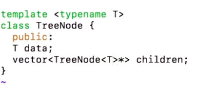

# 4. Templates
Created Wednesday 22 January 2020

* These are used to help us when data types are the only thing that change in a class's private members or function's parameters.
* typename just replaces T everywhere, nothing more nothing less.

syntax:	

* For template definition: 

template <*typename* type_variable1, *typename* type_variable2>
function or class.  

* For declaring templated class object:

*classname *<data_type1, data_type2...> objectname;
For using objects, no further template spec is required.

* For using template functions:

function_name <data_type1, data_type2> (arg1, arg2);
	
The following things are allowed:

1. The param variable's data type may be anything - user defined classes too.
2. Using default values for the type_variable, i.e just write typename = data_type. 
3. **All rules of default functions hold**. **Except** that default type_variables on the left can be used to initialize the the typevariables on the left. **This is allowed as we are not dealing with values, but only data types.**
4. We can omit the places where the default type has been given. for single typename, omit any mention of <>if you don't have to.
5. In declaration of objects, cascading is allowed to any level we wish.

e.g Pair <Pair<int, int>, char>
Note that 

1. Pair<int, int> is a valid data type. 
2. We have to call functions in a cascading fashion too, to get the innermost levels.
3. This is used if Pair was given and we wanted a triplet.

6. We can write return types also using the<> notation.
7. About templates, when we write an object inside a templated class, it is automatically assume to be of type T, unless stated otherwise.

First one is implicit, while the second one is explicit.

Note: 

1. We need to write the template declaration over every class and function. 

*****

[templateDemo.cpp](./4._Templates/templateDemo.cpp)

