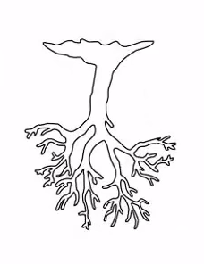

# 1. Introduction to trees
Created Friday 24 January 2020

* There are two kinds of data structures:

1. Physical Data structures - Arrays, LL's, Trees - Changes in memory structure.
2. ADTs - Stack, vector, Queue. No change in memory structure.

* **Trees are a physical(basic) data structures.**
* Hence neither array or LL's can describe them. They are something in their own right.

Jargon:

1. Root 
2. Children and Parents.
3. Siblings - nodes with the same parent
4. Leaf(A node with no children)
5. Subtree, the tree emanating from a node is called a subtree of the tree where the node is a child. Every tree is a subtree of itself.
6. Descendants - All nodes of the subtrees of the given node's children(including them).

* **Why are they called trees?**

