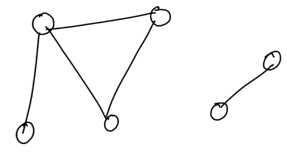
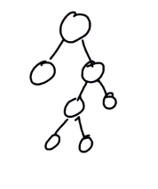

# 1. Intro to graphs
Created Monday 30 March 2020

Graph is a data structure that is used to solve a lot of real world problems like:

1. Social media network.
2. Places connected via roads in a country.

#### Defintion of a graph
A set of vertices and a set of edges(connecting them - does not mean all vertex have to be connected).

Tree vs Graph vs DAG
--------------------

#### Graph
**Graphs** can:

1. Have cycles.
2. Can have disjoint sets of graphs. i.e some vertex may be unreachable from all other vertex. e.g 2 friends who are not friends with another group. The graph is actually a set of two disjoint graphs.

#### Tree
**A tree** is a graph with 3 restrictions. A graph is a tree if it is:

1. Acyclic
2. Connected
3. Undirected

Note: Assigning root of a tree is customary.

#### DAG(Directed Acyclic Graph)
**DAG**(directed acyclic graph) is a directed graph with no directed cycles.

* A DAG's underlying undirected graph may be a tree, but it's not necessary.
* A directed graph is a DAG if and only if it can be topologically ordered - i.e. for every edge from ``p`` and ``q``, ``p`` must occur before ``q`` in the ordered seqeuence.

