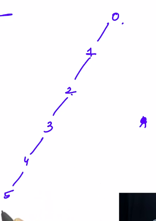

# 2. Cycle Detection
Created Monday 20 April 2020

We discussed in Kruskal's algorithm, that we need to check if a cycle exists, just before adding an edge.


1. In an MST...

One **simple** way is to traverse the graph and keep a **visited** **bag**, if we encounter a duplicate vertex, we skip that edge. **But this has a flaw. **If A and B, C and D are connected, does this mean that BC is not possible, **no, **it could be a valid non cyclic edge(i.e AB and CD are in two disconnected graphs), but our bag will reject this. **This is not a foolproof way. i.e IT is WRONG.**


2. A simple approach, before connecting A and B, check is A is reachable from B(i.e hasPath(A, B)), if it is not connected add them. **This takes too much time though.**

Time Complexity: hasPath(A, B) has complexity O(V+E).


3. Union Find algorithm:

In 1., We were keeping track of vertices only. We to change this idea. We somehow need to keep track of connected components, using which we can check if an edge is being drawn between connected components or not. If they are in a connected component the edge is **not **made, else it added(made).

We assume, initially, that all components are disjoint(only individual points):

1. We maintain an array of these points(from 1 to N). We store the parent of these points at each element.
2. We initialize every element to be equal to i, i.e i is the parent of itself, this ensures that all are disconnected. **We need to maintain that for a connected graph, all the parents the same. (we implement this by keeping keeping all lvals, rvals as superparent. Remember that a super_parent is always reflexive)**
3. To safeConnect i and j, we find their superparents, if they are different, we assign one to the other(any way would do). This essentially does the union operation on the two graphs, making them a connected one. Assignment works both ways coz union is commutative.
```c++
void safeConnect(int i, int j, int arr[], int &edges)
{
    if (arr[i] != arr[j]) // apparently disconnected
    {
        int parent_i = arr[i], parent_j = arr[j]; // choose any of i and j

        // find the superparent of i and j

        // superparent of i
        while (parent_i != arr[parent_i])
            parent_i = arr[parent_i];

        // superparent of j
        while (arr[parent_j] != parent_j)
            parent_j = arr[parent_j];

        // we need to make changes only to the super_parent of either.
        if (parent_j != parent_i)
            arr[parent_i] = parent_j, edges++; // add the edges
        // doing arr[parent_j] = parent_i is the same, what matters is type superparent
    }
    // else do nothing
}
// idea superparent = root, exactly.
```

Calulating time complexity of the algo, worst in case of skewed tree, . i. e.

// T.C = Maximum work is done if all the nodes are connected, either like two lines(parallel or connected at an end) or some other packed config

T.C for Union Find Cycle detection: O(V), in case the tree is skewed(LL). // O(V/k1 + V/k2); k1 and k2 show that we have two LL's , worst case.


* For Kruskal's complexity is O(E); We do this for all the components = Σi = O(V^2^) = O(E) Same as search.


**Proof of correctness(using induction)**:

1. All are a single unions(groups), and that unions always have the same superparent(reachable root).
2. By union operation, we have made some non-atomic groups, each which is a tree(by definition) - no cycle, connectedness.

The members of a group all have the same root(i.e we can reach the root) - does not mean arr[i] is the same as super_parent[i], it is not necessary.

3. Assuming b. holds, i and j can be connected if they have different superparents(roots).  We find the superparents(for both i and j) by iterating on the condition that superparents are always reflexive. Once both are found. We assign a one super_parent's entry to another. This reduces a group and forms bigger tree.


We do this until we have edges = V-1. We have a spanning tree.

*****


* The idea for this could also be obtained by thinking about joining two trees to form a bigger tree. This can be done in the easiest and organized manner by just connecting Tree 2 as a child of Tree 1.


