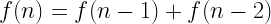
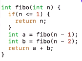
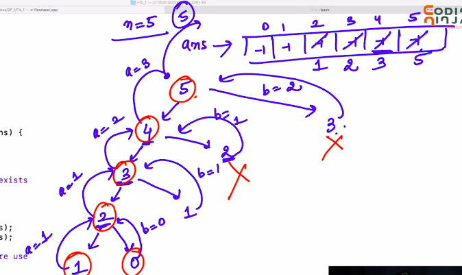
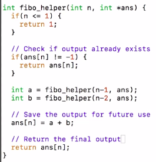
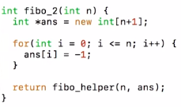

# 1. Fibonacci - 1
Created Sunday 08 March 2020

Let us first discuss a problem: finding the nth fibonacci number.
It can be written like a recursion;

i.e here we do two recursions blindly, this is very costly in terms of time.
Solving using recursive tree.
T(n) = 2T(n-1) + k, on solving using GP formula
T(n) = 2^n-1^.k = O(2^n^)

* We can easily improve this. As f(n) is a function, hence we are repeating the exact work which we had already calculated, i.e **repetition should be **avoided. i.e we should save our work.

Things to keep in mind in **DP**:

* Space required = number of unique calculations = n+1 = 0 to n here. All of the rest are repetitive calls.
* We should plan 'what' thing we are saving at the index 'i'. Here we will save the ith fibonacci number, i.e the final output.
* Remember where we store the array(or note) and where we access it. We can use helper functions or global variables(not advised).
* We are going to use recursion, hence helper is required, so it is imperative that we pass the array as argument.
* Initialize the store first.
* Check if the answer is correct or useless(random garbage or init value, symbolic value).
* Our function should return the answer from the store if it has been calculated, i.e O(1) time. Else it should **calculate(i.e do recursion), store and then return.**
* Recursion is not so costly here.

Analysis after using DP: Nor right calls made. Complexity  = nodes = O(n). Space is also optimized a lot here.

Code using DP:

Discussion: This 'storing' is called memoization. It is a **top-down **approach, where we save the previous answers and use them in the future.

