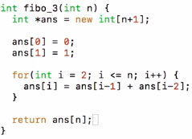
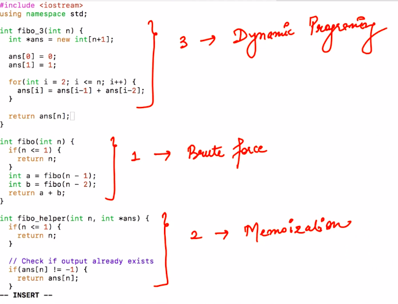

# 2. Fibonacci - 2
Created Monday 09 March 2020

* We will store the answers here too. But here, we will do it iteratively.
* For nth fibonacci, we need n-1 and n-2 th fibonacci. Dependency identified. The only independent cases are for n = 0 and n = 1. These are the smallest problems.
* We will fill the smallest problems. Now our dependencies are fulfilled.

This code is the 3rd approach:

*****

Things to note, jargon:

So the three approaches are:

1. Bruteforce: Unoptimized code. Laziest solution.
2. Memoization - Top-down approach

We try to solve the **largest** problem **first**, but if it is not solved yet, we solve it's dependencies. This continues until we reach a point where the base case values are present. From there start the returning phase of the recursion, where we solve all the problems to finally solve our required task. **We try to solve the hardest problem first, hence this is called a top-down approach.**

* Memoization(i.e top-down) is usually recursive. As recursive makes the call for smaller unfufilled dependencies.
* Recursive algorithms take up some extra space and time as compared to DP.
* Memoization is possible only if an **optimal substructure exists.** 

3. Dynamic Programming - Bottom-up approach

We try to **explicitly** solve all the dependencies **first**, then we try to solve the harder problems, till we reach the required problem. Which can be solved as all previous ones have now been solved.

* DP(bottom-up) is usually iterative, since all dependencies are met at every point. **i.e **There's no need of recursion.
* Bottom up **does not mean** that we **need **to start from the 'starting point' in the problem, bottom means starting from the concrete values, anywhere in the system.
* DP does not require initialization. As all value are written using the dependencies. If a value is to be written, it shall be, using the

Problem solving strategy: We first write the naive recursive solution. Then we write the memoized approach. Then we refine it to DP by dependency analysis. We have to follow this now, until we develop the skill to directly write DP solutions. **Don't solve in one go, as this stops the learning process.**

