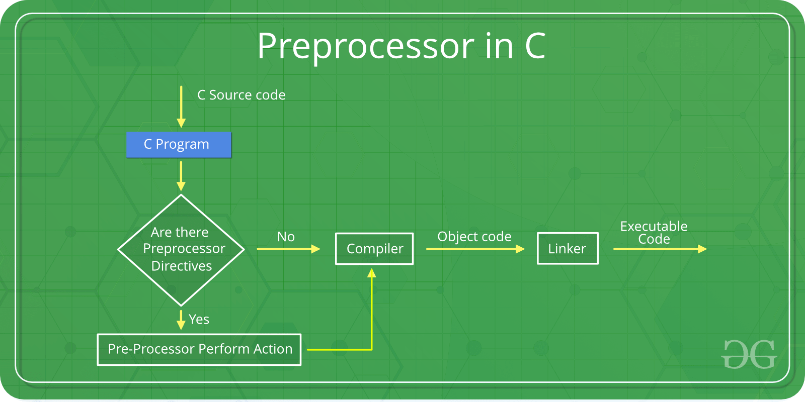

# 1. Macros and Global Variables
Created Thursday 26 December 2019


* We are going to learn a few keywords which help us write better code.
* Reason for using these keywords: Whatever we have learnt till now, is correct. But when it comes to some use-cases, we found that other methods are better optimized and/or help in organization.
* Format: Keyword along with syntax, reason and explanation.


*****


#### Macros
**Syntax: **
```c++
#define macro_template macro_expansion

#define h "Hello, world" // example
```
**Reason/Motivation:**
use-case: Suppose we want to make a program which works with circles, we need to use π = 3.1416.

* Now we can manually write 3.1416 everywhere in our code. That'll be too tedious to write, and difficult to change. It is also error prone, as a programmer may mess up the values at places.
* We can use a global variable named pi = 3.1416. This will pollute the namespace.

**Explanation(Working):**
We need the best of both world's, i.e both maintainance and performance/checking_for_correctness.
We use **#define**.
Consider the known pre-procesor directive case, **#include**, this copies file content, from the header files. So we can use all the basic code.
#define pi 3.14, is also a pre-processor directive. It **replaces** each 'pi' written in our code by 3.14. This is done before compilation, i.e the compiler is not involved.
*It's basically text substitution in code, before compilation. Compiler will recieve code which has 3.14 written everywhere in place of pi.*
**Note: **Any errors in the #define mostly go undetected.
<https://www.geeksforgeeks.org/cc-preprocessors/>

**About Macros:**

* Macro is a piece of code in a program which is given some label. Whenever this name(label) is encountered by the preprocessor, the label gets replaced by the actual piece of code. The ‘#define’ directive is used to define a macro.
* In the above program, when the compiler executes the word LIMIT, it **replaces** it with 5. The **word** ‘LIMIT’ in the macro definition is called a **macro template** and ‘5’ is called the **macro expansion**.

**Note**:

* No semi-colon at the end of macro definition, as they are not statements.
* There are two kinds of macros:
	1. Without argument
	```c++
	#define pi 3.14
	```

  1. With argument - Macros defined with arguments are similar to inline functions.
	```c++
	#define AREA(l, b) l*b

	// Template needs to be in f(a, b, c) form
	/*
		There are two replacements here:
		1. AREA(l*b) --> l*b
		2. l*b --> 5*10
	*/
	```

* Macros are pure copy and paste, so operator precedence should be taken care of.

e.g AREA(2+3, 4+5) will be replaced by 2+3*4+5 = 2+12+5 =19

*****


2. Global Variables

**Syntax:  **Just define the variable outside of outside of every function, i.e it'll be accessible anywhere(assuming it is not shadowed😆️).
**Reason/Motivation:**

* We can access modify the value anywhere.

**Explanation(Working): **
Basic declaration and memory allocation. It is saved in a different part of the code, it's lifetime is the same as that of the program.
**About Global variables:**
It is a very **bad **practice to use global variables, if other ways like(call by reference are available). It can lead to very unintuitive scenarios, where we will have to check the whole program to find the bugs.
**Conceptual problems: **This is conceptually problematic as a variable that is used by all, if mishandled by some function, can **jeopardize** the whole program.

