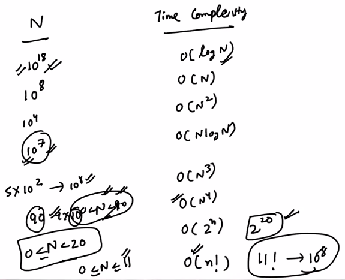
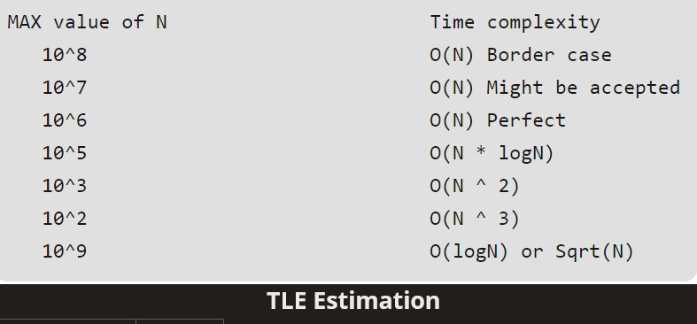

# c. Constraints
Created Thursday 23 April 2020

1. Time Limit - Mostly 1 s or 2s or ... 100s(rare).
2. Memory Limit - 256MB (it's never less generally).
3. Input Range, e.g 1 <= N <= 10^6 ^- mostly integer.
4. Element range, e.g 0<=A[i]<=10^8^ - helps us decide the type of input variable.

How to analyze the constraints:

1. Average ops are 10^8 ^per second. If our T.C is > 10^8 ^* Time_Limit(in s), then we get TLE(Time Limit Exceeded). **We assume** **that all judges have the same speed.**

Slighltly better looking

