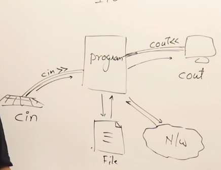
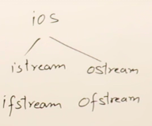

# 2. C++ File streams
Created Saturday 25 April 2020

* Streams are used for accessing data from some source(input devices, files or networks) or sending data to a network, file, output devices.

* For achieving this communication, we use the mechanism of streams(literally a pipe or river) in C++.

* In C++, for I/O we have a built-in class, called iostream  - input output stream. This has two classes inside, istream, ostream.
	* We have the cin built-in object of class istream which has the extraction operator(>>) overloaded with it.
	* cout is an built-in object of ostream class and has the insertion operator(<<) overloaded with it. 
	* Both are available in iostream.

* For file handling, we have fstream class, which has ifstream and ofstream.

[~/home_files/git_dir/zim-desktop-wiki/zim/www.py](file:///Users/muhammadsanjar/home_files/git_dir/zim-desktop-wiki/zim/www.py)

