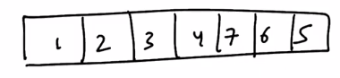

# 1. Tries and XOR
Created Monday 27 July 2020

Return maximum bitwise XOR pair possible with the query.
Here we have 7 - 111 and 1 - 001 i.e 110 is the max.
O(n^2^) - naive possible.

But it can be done in nlog(max) using trie.

*****

* We construct a trie by inserting the elements one by one.
* Now we are given queries, with a given argument. argument ⊕ ele = most ones(starting from left, i.e 1100 is better than 0111). We search for ~argument. Because that will increase our xor value.
* This is easily searchable in a tree.
* Consequently, we have our answer after the tree is fully constructed.
* Time for insertion = log(bits in maximum)
* Searching = log(bits in maximum)
* T.C = O(N * log(max_n))

Code: 10 minutes.
Make a node. Has no value, we just want to represent the bit.
[./code/trieMaxXOR.cpp](./1._Tries_and_XOR/code/trieMaxXOR.cpp)

