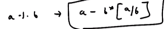

# 2. Complexity of Euclid's GCD algorithm
Created Tuesday 28 July 2020

Do two steps of the algorithm, then consider the minimum possible changes. The value of smaller < a/2. 

This will halve again in two steps. And so on. We can say that for the worst case, we have a/2^k^. This will reach 1 in k =log(a) steps. a = max(a, b).
Hence, the complexity is O(log~2~(max(a, b))).
And this is obviously < O(min(a, b))

