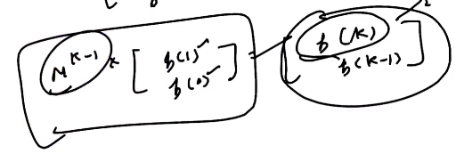

# 3. Matrix Exponentiation
Created Saturday 01 August 2020

* It is used in representing and solving recurrence relation.
* We need to find a square M, such that M x kth_state = k+1_th_state. If we can do so, matrix exponentiation is applicable. k_th state is a column vector.
* We can find the nth Fibonacci number using this in [log(n)](https://www.youtube.com/watch?v=EEb6JP3NXBI) time.

* This is DP
* Used very often in CP

