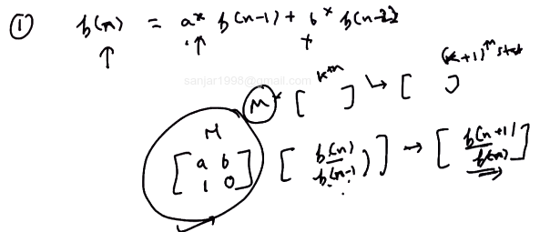
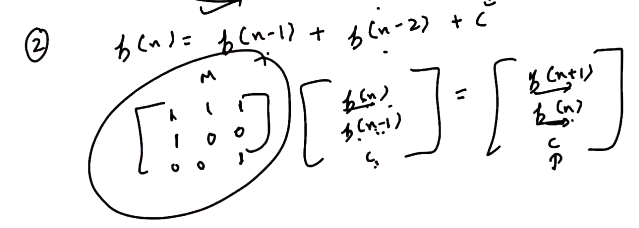
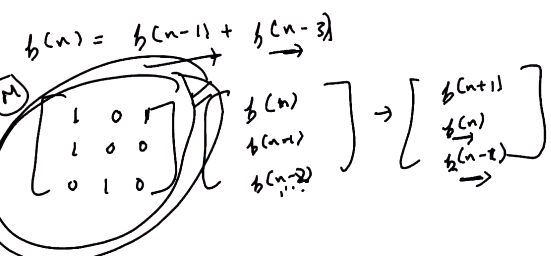
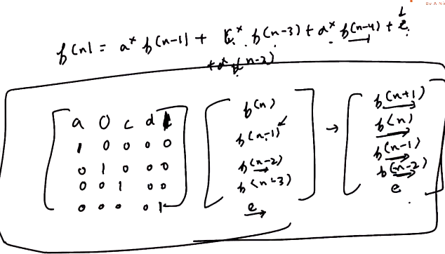
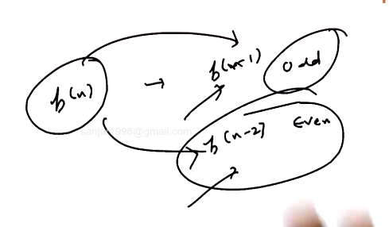

# 1. Matrix Exponentiation - More Recurrence Relation
Created Saturday 01 August 2020

1. a*f(n-1)+b*f(n-2)

2. Adding a constant

3. Having a difference of 2. We need to keep f(n-2) as well.

4. All in one

5. For piece wise, do the matrix piece wise(if statement)

* All solutions are log(n). Assuming matrix multiplications to be O(1).

