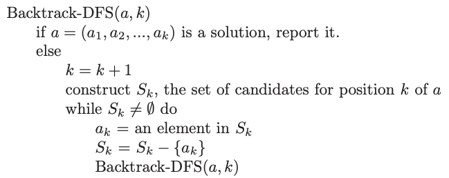
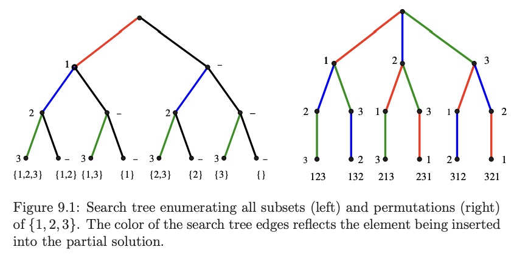
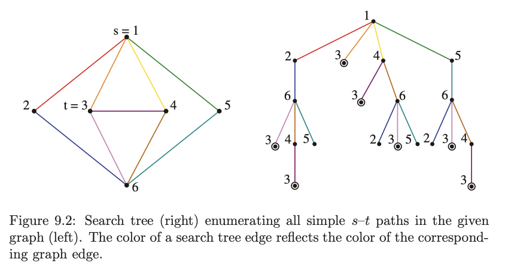

---
tags:
  - backtracking
  - index
---
# 1. BackTracking
Created Monday 22 June 2020

## What is backtracking
- Backtracking is an approach where we explore all possible paths efficiently.
- At each step in the backtracking algorithm, we try to extend a given partial decision set (e.g. stored as an array) by adding another element at the end. If it's a final decision (useful), we note it down. If its not final, we check if its worth continuing, if no, we stop otherwise we continue extending the decisions.

e.g There are 10 bags with some items.
Print the name on the bag if a ball exists in the bag.

- Backtracking is a kind of thinking(approach), not an algorithm.
- Backtracking and recursion are different. Backtracking is an approach and recursion is the algorithm used to solve the problem.
- Backtracking is implemented using recursion.

## General backtracking algorithm (DFS tree)
Backtracking constructs a tree of partial decisions, where each node represents a partial decision, and leaves represent valid/invalid decisions.

This means backtracking is a DFS traveral.



Note:
- We can consider path as BFS too, but its too memory intensive (max children is high) for most problems.


## Backtrack maid
1. We Consider all possibilities.
2. We traverse instead of storing.
3. Define a decision space (array of bools/integers etc). It should be linear fixed size.
4. We maintain read/write mapping between decision space and app's data structure. *Linear (array) is the simplest to advance and backtrack*.
5. On each decision position, generate valid possibilities.
6. Since decision space is shared, we have to do forward (write) and backward (reset) operations for each candidate decision, so the next candidate is unhindered.
7. Backtracking enumerates all possible decision sequences. Cycles are avoided because each path is uniquely represented by its decisions.

Note (non trivial):
- We maintain a linear decision space irrespective of the app's data structure.
- Shared decision space.
- Simple: there may be many (distinct) valid decisions. If you only need one decision stop early.
- Movement in decision space may not be serial, there may be an ordering to it. Still, there's no chance of cycles since we do forward-and-backward-ops for each decision.

## Common backtracking problems
The common thing in all backtracking problems is the "decision you make".
1. All subsets - decision is a boolean array of size "alphabet-size".
2. All permutations - decision is a int array of size "alphabet-size".
3. All paths from source to target in a graph - decision is a int array of size V.





Note:
- Define the decision transition function early on based on problem:
	- Subsets - to include or not to include.
	- Permutations - what will be the next element (and swap it with current head). *it can get a bit involved like this*.
- Storage - Usually, we want to traverse over all possible decisions, instead of storing them. This may mean keeping a max size array (i.e. max candidate size) and doing operations on it as we traverse through the decision
- Efficient - Backtracking means enumeration, but it should be efficient - we should backtrack as soon as we know forward decisions in the current path are doomed to fail, or have already been seen. i.e. *early backtrack and avoid duplicate is important in backtracking*.
- Order of output - Another thing in backtracking is the order of output - so if the answer needs to be in sorted order, we must use recursion instead of bitwise-gen (suppose problem is subset gen), since recursion maintains sorted order by default.
- Handling deduplication: 
	- Requirement: we must make sure each configuration is processed only once (especially if order of decisions does not matter).
	- How to do it: by creating a structure that solves dedup automatically. Bottom-up and top-down arent always equivalent, for example.


## Subsets
```cpp
class Solution {
public:
    vector<vector<int>> helper(vector<int>& nums, vector<bool>& decisions,
                               int start) {
        // act if decision actionable
        if (start == nums.size()) {
            // now take the elements and return
            vector<int> retval;
            for (int i = 0; i < nums.size(); i++) {
                if (decisions[i]) {
                    retval.push_back(nums[i]);
                }
            }
            return {retval};
        }

        // intermediate (decision not ready)
        // generate next steps
        vector<bool> candidates{false, true};
        vector<vector<int>> retval;

        for (auto candidate : candidates) {
            bool temp = decisions[start]; // store for cancellation
            decisions[start] = candidate; // make move
            auto outputs = helper(nums, decisions, start + 1); // go down
            for (auto output : outputs) {
                retval.push_back(output);
            }
            decisions[start] = temp; // cancel move (backtrack)
        }

        return retval; // all outputs
    }

    vector<vector<int>> subsets(vector<int>& nums) {
        vector<bool> decisions(nums.size(), false);
        return helper(nums, decisions, 0);
    }
};
```

## Permuations
```cpp
class Solution {
public:
    vector<vector<int>> helper(vector<int>& nums, vector<int>& decisions, int start) {
        // CHATGPT-COMMENT-HERE
        /*
            pruning logic would come here, if we think the current decision won't lead to useful ones
            we'll return here itself
        */
        if (start == nums.size()) 
        // CHATGPT-COMMENT-HERE if the problem allows, explicit deduplication would go in here
        return {decisions};

        vector<vector<int>> retval;
        // candidates (choose the next one from one of the existing), by replacement
        for (int i = start; i < nums.size(); i++) {
            // select the current element as the start
            int curr = decisions[start];
            int replacer = decisions[i];

            // swap
            decisions[start] = replacer;
            decisions[i] = curr;

            auto outputs = helper(nums, decisions, start + 1);
            for(auto output: outputs) {
                retval.push_back(output);
            }

            // reverse
            decisions[start] = curr;
            decisions[i] = replacer;
        }

        return retval;
    }

    vector<vector<int>> permute(vector<int>& nums) {
        vector<int> decisions (nums.begin(), nums.end()); // deliberate
        return helper(nums, decisions, 0);
    }
};
```